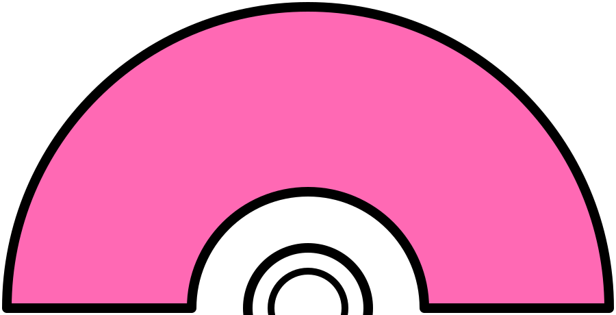

<p align="center">
  
</p>

<p align="center">
  
</p>

<div align="center">



<details>
<summary>Open profile</summary>

<br>

<div>
  <div align="center">
    
  </div>

  <div align="center">
    <a href="https://git.io/typing-svg">
      
    </a>
  </div>
</div>

<details>
<summary>About me</summary>

[//]: # "You must have a lf before the markdown element when inside a block for it to work: https://stackoverflow.com/questions/29368902/how-can-i-wrap-my-markdown-in-an-html-div"

<div align="left">

```js
/**
 * Represents me.
 *
 * @constructor
 * @param {string} name - Raghda Gad.
 * @param {string} jobTitle - Computer Engineering Student.
 * @param {string} specialization - Aspiring .NET Backend Developer.
 * @param {string} currentlyLearning - C#, ASP.NET Core, SQL Server, Git/GitHub.
 * @param {string} askMeAbout - C++, Java, Data Structures & Algorithms.
 * @param {string} lookingToCollaborate - Beginner-friendly software development projects.
 * @param {string} lookingForHelp - Backend development and problem solving.
 * @param {string} funFact - I enjoy learning new technologies and turning ideas into real projects.
 * @param {string} approachable - Yes, to collaborate on exciting projects, don't hesitate to reach out.
 * @param {string} strength - Curiosity & Consistency.
 * @param {string} weakness - Getting lost in a good bug hunt.
 *
 * @throws {Bug} To any and all bugs.
 *
 * @returns {Object} Raghda.
 */
```

</div>

</details>

<details>
<summary>Tools</summary>

<div>
  <p style="display: inline-block;" align="center">

```
<kbd>
  <kbd>Programming Languages</kbd>
  <br>
  <br>

  
  
  
  
</kbd>

<kbd>
  <kbd>Back-end</kbd>
  <br>
  <br>

  
  
  
</kbd>

<kbd>
  <kbd>Front-end</kbd>
  <br>
  <br>

  
  
  
</kbd>

<kbd>
  <kbd>Database</kbd>
  <br>
  <br>

  
  
  
</kbd>

<br>
<br>

<kbd>
  <kbd>Design & Creative Tools</kbd>
  <br>
  <br>

  
  
  
</kbd>

<kbd>
  <kbd>Operating System & Tools</kbd>
  <br>
  <br>

  
  
  
</kbd>

<kbd>
  <kbd>Editors</kbd>
  <br>
  <br>

  
  
</kbd>
```

  </p>
</div>

</details>

<details>
  <summary>Currently Learning</summary>

  <br>

  <ul>
    <li><strong>C# & ASP.NET Core:</strong> Building the foundations for backend web development with .NET.</li>
    <li><strong>SQL Server:</strong> Practicing database design, queries, and relationships.</li>
    <li><strong>Git & GitHub:</strong> Improving version control workflow and collaboration skills.</li>
  </ul>

</details>

<details>
  <summary>Quote</summary>

  <br>

  <blockquote>
    "The only way to learn a new programming language is by writing programs in it."
    <br>
    <strong>— Dennis Ritchie</strong>
  </blockquote>

</details>

<details>
  <summary>Free DOSE hit</summary>

  <br>

  <small>
    <i>DOSE (dopamine, oxytocin, serotonin & endorphin), refresh page if dose was ineffective.</i>
  </small>

  <br>

  <div align="center">
    
  </div>

</details>

<details>
<summary>What can I do for you?</summary>

<table style="border: none">

  <tr>

```
<td width="50%" valign="top">
```

## Let's Work on Your Project Together!

If you have any questions about backend development, C#, ASP.NET Core, or beginner-friendly collaborations, feel free to <a href="https://www.linkedin.com/in/raghda-gad-861268361" target="_blank">reach out on LinkedIn</a>, I won't bite, I promise.

```
</td>

<td width="50%" valign="top">
```

## It's not perfect, isn't it?

****

<blockquote>
"A bug is never just a mistake, it's a chance to understand something a little better."
</blockquote>

```
</td>
```

  </tr>

</table>

</details>

</details>


</div>

<div align="center">

  <a href="https://www.linkedin.com/in/raghda-gad-861268361" target="_blank">
    
  </a>

</div>

---

Last Edited on: 12/09/2026
